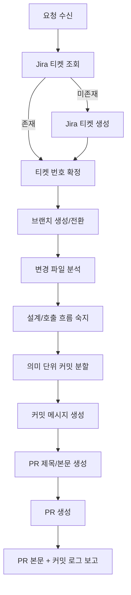

# PR 자동화 실행 명령

아래 사용자 요청을 입력으로 받아, **Jira → Git 브랜치/커밋 → PR 작성**을 끝까지 수행한다.

## 입력 문장 예시
- `application.dto를 command/query/result로 세분화했으니까 이거 PR 만들어줘`
- `Auth/User 리팩토링 작업 기반으로 PR 생성해줘`

## 필수 동작 규칙
1. 작업 유형을 `feat | refactor | fix | test` 중 하나로 확정한다. 불명확하면 사용자에게 1회 질문한다.
2. Jira MCP로 관련 티켓을 검색한다.
3. 티켓이 없으면 Jira MCP로 새 티켓을 생성한다.
4. 브랜치는 **반드시 `{type}/{숫자티켓번호}`** 형식으로 생성/전환한다.  
   - Jira 키가 `KAN-98`이면 숫자 `98`만 사용해 `feat/98`, `refactor/98`로 만든다.
   - `KAN-98` 같은 키 전체를 브랜치명에 넣지 않는다.
5. **커밋 전에 반드시 코드 설계를 먼저 분석/숙지**한다.
   - 변경 파일을 `Controller / UseCase(Service) / Port(Adapter) / Domain(Entity, VO, Event) / Config` 관점으로 분류한다.
   - 어떤 유스케이스가 어떤 계층으로 연결되는지 요약한 뒤, 그 이해를 기준으로 커밋 단위를 나눈다.
6. 변경 파일을 분석해 **의미 단위(권장 1~4파일)** 로 커밋 그룹을 만든다.
7. 커밋 메시지는 반드시 `<브랜치명> :: <커밋 내용>` 형식으로 작성한다.
8. PR 제목/본문을 저장소 규칙에 맞게 생성한다.
9. PR 본문에 **Mermaid 플로우**를 포함한다.
10. 최종적으로 사용자에게 아래 2가지를 반드시 보여준다.
   - PR 본문(마크다운)
   - 커밋 로그(최근 커밋 요약)

## 안전장치
- 현재 워킹트리에 다른 이슈 변경이 섞여 있으면, 대상 파일만 선택적으로 add 한다.
- 커밋 대상이 불명확하면 자동으로 전부 add 하지 말고 사용자에게 확인한다.
- Jira MCP/GitHub 권한 부족으로 자동 생성이 실패하면, 실패 이유와 수동 대체 절차를 명확히 출력한다.

## 커밋 분할 기준
- 아래 우선순위로 그룹핑한다.
1. 기능/유스케이스 단위 (예: 로그아웃 처리, 밴 이벤트 처리)
2. 아키텍처 계층 단위 (Controller, UseCase/Service, Port/Adapter, Entity/Config)
3. 파일 수 제약 (커밋당 1~4개 권장, 강하게 연관된 파일은 같은 커밋 허용)

## 커밋 전 분석 체크리스트 (필수)
1. 변경 파일 목록과 각 파일의 역할(계층/도메인)을 요약한다.
2. 핵심 호출 흐름(입력 → 서비스 → 저장/이벤트 발행)을 파악한다.
3. 결합도가 높은 파일은 같은 커밋으로, 독립 변경은 분리 커밋으로 배치한다.
4. 분석 없이 즉시 add/commit 하지 않는다.

## PR 제목 규칙
- 형식: `<type>/<ticketNumber> :: <subject>` 또는 `<type>: <subject>`
- 저장소 PR 검증 워크플로 정규식에 맞게 생성한다.

## PR 본문 템플릿
아래 템플릿을 채워서 생성한다.

````md
## 📌 관련 이슈
- close #<ticketNumber>

---

## 📝 변경 사항 요약

### 작업 유형
- [ ] ✨ feat: 새로운 기능 추가 `(기능 단위 완료 후 PR)`
- [ ] 🐛 fix: 버그 수정 `(버그 1개 = PR 1개)`
- [ ] ♻️ refactor: 코드 리팩토링 `(작업 단위 완료 후 PR)`
- [ ] ✅ test: 테스트 코드 추가/수정 `(작업 단위 완료 후 PR)`

### 변경 내용
<핵심 변경점 bullet>

### 변경 이유
<왜 필요한지 설명>

---

## ✅ 테스트 체크리스트
- [ ] 단위 테스트 작성 및 통과
- [ ] 통합 테스트 통과
- [ ] 기존 기능 정상 동작 확인 (Regression)
- [ ] API 응답값 확인
- [ ] 예외 케이스 처리 확인
- [ ] 로컬 환경에서 직접 테스트 완료

---

## 📸 스크린샷 / 로그
<details>
<summary>펼쳐보기</summary>

<로그 또는 캡처>

</details>

---

## 🔄 동작 플로우 (Mermaid)


## 💬 리뷰어에게
<리뷰 포인트와 영향 범위>
````

## 최종 출력 형식
마지막 응답은 아래 순서를 따른다.
1. 생성/연결된 Jira 티켓 정보
2. 생성된 브랜치명
3. 커밋 목록 (해시 + 메시지)
4. PR 제목
5. PR 본문 전체
6. 생성된 PR 링크 (생성 실패 시 실패 원인 + 수동 생성용 명령)
