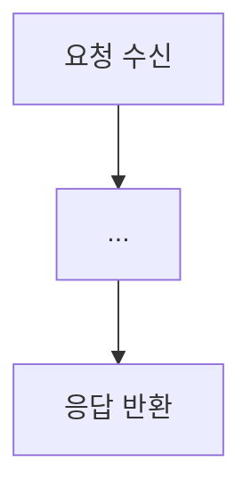
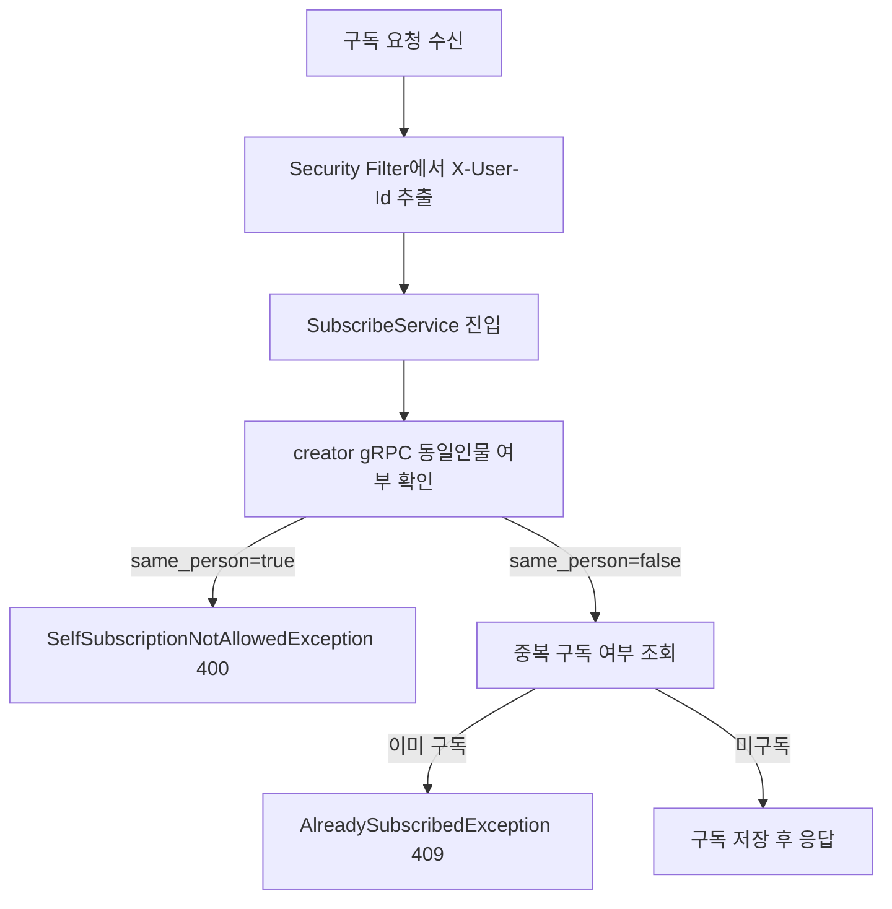

# GitHub PR 전략

> Repository: `f-lab-edu/MagicBox`
> GitHub MCP Tool: `mcp__github__create_pull_request`

---

## 1. 기본 원칙

- PR은 **기능/리팩터링 단위 완료 후** 생성한다. 미완성 상태로 PR을 열지 않는다.
- PR 생성 전 반드시 **JIRA 티켓이 존재**해야 한다. (`JIRA_TICKET_STRATEGY.md` 참고)
- PR 제목과 본문은 GitHub Actions `pull-request-validate.yml` 검증을 **반드시 통과**해야 한다.
- PR 본문은 `.github/pull-request-template.md` 양식을 **빠짐없이 채운다**.

---

## 2. PR 제목 규칙

### 2-1. 검증 정규식 (CI 자동 검사)

```
^(feat|fix|refactor|test)(\/[0-9]+|\(.+\))?(\s*::|:) .{1,}
```

### 2-2. 허용 형식

| 형식 | 예시 |
|------|------|
| `feat/{번호} :: {제목}` | `feat/49 :: 구독 서비스 생성` |
| `refactor/{번호} :: {제목}` | `refactor/98 :: Auth/User DTO 구조 정리` |
| `feat({scope}): {제목}` | `feat(subscribe): 구독 서비스 생성` |
| `refactor({scope}): {제목}` | `refactor(user): UserService 레이어 분리` |

> **번호**는 JIRA 티켓 번호에서 숫자만 사용한다. (KAN-49 → 49)

### 2-3. 허용 type

| type | 사용 조건 |
|------|-----------|
| `feat` | 새로운 기능 추가, API 신규 개발 |
| `fix` | 버그 수정 (버그 1개 = PR 1개) |
| `refactor` | 외부 동작 변경 없는 코드 구조 개선 |
| `test` | 테스트 코드 추가/수정 |

### 2-4. 제목 작성 가이드

- 한국어로 작성, 동사 명사형으로 끝내기 (`구현`, `추가`, `정리`, `적용`)
- 30자 이내로 핵심만 표현

---

## 3. PR 본문 작성 규칙

### 3-1. CI 검증 필수 섹션 (누락 시 PR 차단)

| 섹션 | 키워드 |
|------|--------|
| 관련 이슈 | `관련 이슈` |
| 변경 사항 요약 | `변경 사항 요약` |
| 테스트 체크리스트 | `테스트 체크리스트` |

### 3-2. 전체 본문 템플릿

````markdown
## 📌 관련 이슈
- close #{JIRA 티켓 번호}

---

## 📝 변경 사항 요약

### 작업 유형
- [ ] ✨ feat: 새로운 기능 추가 `(기능 단위 완료 후 PR)`
- [ ] 🐛 fix: 버그 수정 `(버그 1개 = PR 1개)`
- [ ] ♻️ refactor: 코드 리팩토링 `(작업 단위 완료 후 PR)`
- [ ] ✅ test: 테스트 코드 추가/수정 `(작업 단위 완료 후 PR)`

### 변경 내용
- {변경한 것 bullet, 계층/서비스 단위로 그룹핑}

### 변경 이유
- {왜 이 변경이 필요했는지 — 도메인/기술적 근거}

---

## ✅ 테스트 체크리스트
- [ ] 단위 테스트 작성 및 통과
- [ ] 통합 테스트 통과
- [ ] 기존 기능 정상 동작 확인 (Regression)
- [ ] API 응답값 확인
- [ ] 예외 케이스 처리 확인
- [ ] 로컬 환경에서 직접 테스트 완료

---

## 📸 스크린샷 / 로그
<details>
<summary>펼쳐보기</summary>

{로그 또는 스크린샷}

</details>

---

## 🔄 동작 플로우 (Mermaid)


## 💬 리뷰어에게
{리뷰 포인트와 영향 범위 — 리뷰어가 집중해서 봐야 할 코드/흐름}
````

---

## 4. 섹션별 작성 가이드

### 4-1. 관련 이슈
- `close #` 뒤에 반드시 **JIRA 티켓 번호(숫자만)** 를 붙인다.
- 예: `close #49` (KAN-49에 해당)

### 4-2. 변경 내용
- **서비스/계층 단위로 그룹핑**해서 작성한다.
- 계층 순서: `도메인 → 애플리케이션(UseCase/Service) → 어댑터(Controller/gRPC/Kafka) → 설정`
- 각 bullet은 **"무엇을 했다"** 형태로 구체적으로 작성한다.

**feat 예시**
```
- creator 서비스에 `IsCreatorAndSubscriberSamePerson` gRPC 계약/서버를 추가했습니다.
- subscribe 서비스에 도메인/애플리케이션/어댑터/예외/보안/설정 계층을 구성했습니다.
- creator gRPC 호출 경로에 CircuitBreaker(`creatorService`)와 fallback(503)을 적용했습니다.
- Kafka 이벤트(`user-banned`, `user-withdrawn`, `creator-revoked`) 수신 시 구독 정리 로직을 추가했습니다.
```

**refactor 예시**
```
- Auth 서비스 DTO 패키지 구조를 command/result/request/response 기준으로 정리했습니다.
- User 서비스 DTO/UseCase 시그니처를 command/query/result 구조로 리팩토링했습니다.
- SonarCloud Java binaries/컴파일 단계 설정을 워크플로우에 반영했습니다.
```

### 4-3. 변경 이유
- "왜 이 구조가 필요한가"를 **도메인 또는 기술 근거**로 1~3줄 설명한다.
- "기능을 추가했기 때문" 같은 동어반복은 금지.

**예시**
```
creator 식별 검증을 creator 서비스 책임으로 분리해 도메인 경계를 명확히 유지하기 위해 gRPC 연동을 추가했습니다.
```

### 4-4. 테스트 체크리스트
- 완료한 항목만 `[x]` 체크한다. 미완료 항목을 임의로 체크하지 않는다.

### 4-5. Mermaid 동작 플로우
- **모든 PR에 포함 필수**
- 핵심 요청 흐름을 `flowchart TD` 형식으로 작성한다.
- 예외 분기(409, 404, 503 등)도 포함한다.
- 노드 이름은 한국어로 의미를 명확히 표현한다.

**예시**


### 4-6. 리뷰어에게
- 리뷰어가 **집중해서 봐야 할 코드/흐름**을 구체적으로 명시한다.
- 설계 결정의 트레이드오프가 있었다면 배경을 짧게 설명한다.
- 예외 처리 순서, 이벤트 흐름, CircuitBreaker 설정 등 검토 요청 포인트를 bullet로 정리한다.

---

## 5. MCP Tool 호출 방법

```
mcp__github__create_pull_request(
  owner: "f-lab-edu",
  repo: "MagicBox",
  title: "feat/49 :: 구독 서비스 생성",   // 제목 규칙 준수 필수
  body: "...",                             // 섹션 3-2 템플릿 완전히 채울 것
  head: "feat/49",                         // 작업 브랜치
  base: "main",                            // 기본 병합 대상
  draft: false
)
```

> **base 브랜치 판단 기준**: 독립 기능은 `main`, 다른 기능 브랜치에 의존하는 경우 해당 브랜치를 base로 설정한다.
> 예) `feat/47`이 `feat/98` 완료 이후에 병합 가능한 경우 → `base: "feat/98"`

---

## 6. PR 생성 전체 흐름

```
JIRA 티켓 확인 (JIRA_TICKET_STRATEGY.md 참고)
    ↓
GitHub 브랜치 확인 (JIRA_TICKET_STRATEGY.md 섹션 8 참고)
    ↓
작업 완료 + 커밋 (GITHUB_COMMIT_STRATEGY.md 참고)
    ↓
[필수] 전체 서비스 기동 확인 (docker-compose.local.yml 기준, 모든 서비스 정상 기동 확인)
    ↓
PR 제목 결정: <type>/{번호} :: <제목>
    ↓
PR 본문 작성: 섹션 3-2 템플릿 완전히 채우기
    (변경 내용 → 변경 이유 → 테스트 체크 → Mermaid → 리뷰어에게)
    ↓
mcp__github__create_pull_request 호출
    ↓
생성된 PR URL 사용자에게 보고
```

---

## 7. PR 생성 후 보고 형식

```
✅ JIRA 티켓: KAN-49
✅ GitHub 브랜치: feat/49
✅ PR 생성 완료: https://github.com/f-lab-edu/MagicBox/pull/17
```

---

## 8. 금지 사항

- PR 제목에 `KAN-{번호}` 형식 포함 금지 → 숫자만 사용 (KAN-49 → 49)
- 본문 필수 섹션(`관련 이슈`, `변경 사항 요약`, `테스트 체크리스트`) 누락 금지 → CI 차단
- Mermaid 플로우 생략 금지
- 미완성 기능으로 non-draft PR 오픈 금지
- 테스트 체크리스트 허위 체크 금지
- **전체 서비스 기동 확인 없이 PR 생성 금지** → `docker-compose.local.yml` 기준 모든 서비스가 정상 기동되어야 PR을 올릴 수 있다